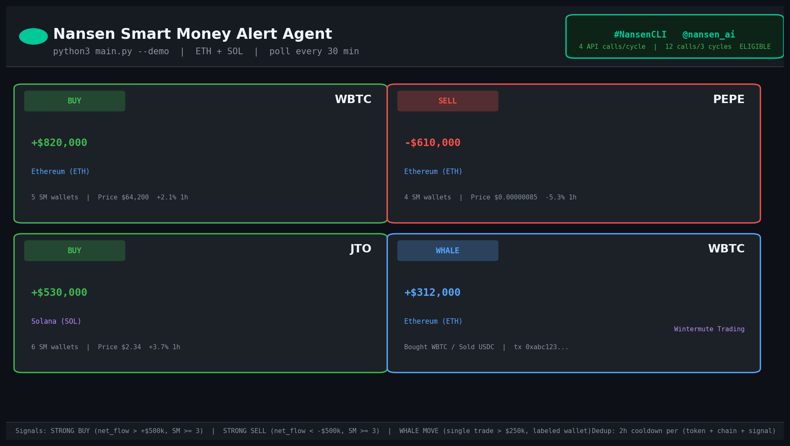
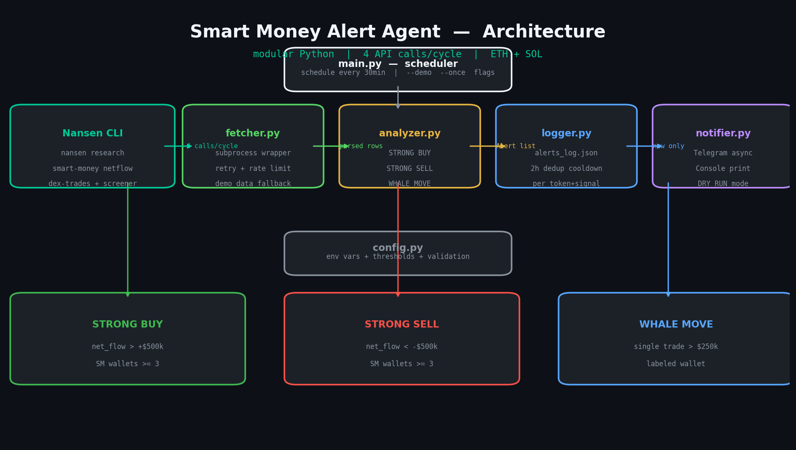

# 🤖 Nansen Smart Money Alert Agent

> Real-time on-chain Smart Money monitoring with instant Telegram alerts.
> Built for the [**#NansenCLI Challenge**](https://x.com/nansen_ai) · [@nansen_ai](https://twitter.com/nansen_ai)



---

## What It Does

Polls the **Nansen CLI** every **30 minutes** across Ethereum + Solana.
When Smart Money makes a significant move, you get a **Telegram alert instantly** — before it hits the news.

| Signal | Trigger | Example |
|--------|---------|---------|
| 🟢 **STRONG BUY** | `net_flow_usd > +$500k` AND `smart_money_count >= 3` | WBTC +$820k, 5 SM wallets |
| 🔴 **STRONG SELL** | `net_flow_usd < -$500k` AND `smart_money_count >= 3` | PEPE -$610k, 4 SM wallets |
| 🐋 **WHALE MOVE** | Single DEX trade `> $250k` by a labeled wallet | Wintermute buys WBTC $312k |

---

## Architecture



```
main.py (scheduler: every 30 min)
    │
    ├── fetcher.py   → Nansen CLI subprocess wrapper (4 API calls/cycle)
    │                  smart-money netflow ETH + SOL
    │                  smart-money dex-trades ETH
    │                  token screener ETH
    │
    ├── analyzer.py  → Signal detection (STRONG BUY / SELL / WHALE MOVE)
    │
    ├── logger.py    → JSON dedup log (2h cooldown per token+chain+signal)
    │
    ├── notifier.py  → Telegram async + console output
    │
    └── config.py    → Env vars + thresholds + validation
```

---

## Quick Start

### 1. Install Nansen CLI
```bash
npm install -g nansen-cli
nansen login --api-key YOUR_NANSEN_API_KEY
```

### 2. Install Python deps
```bash
pip install -r requirements.txt
```

### 3. Set environment variables
```bash
export NANSEN_API_KEY="your_nansen_key"
export TELEGRAM_BOT_TOKEN="your_bot_token"   # from @BotFather on Telegram
export TELEGRAM_CHAT_ID="your_chat_id"       # from @userinfobot on Telegram
```

### 4. Run

```bash
# Demo mode — no API keys needed, uses built-in sample data:
python main.py --demo

# Live mode — real Nansen data + Telegram alerts:
python main.py

# Single poll and exit:
python main.py --once
```

---

## Demo Output

```
╔══════════════════════════════════════════════════════╗
║    🤖  Nansen Smart Money Alert Agent                ║
║    Monitoring ETH + SOL for whale movements          ║
╠══════════════════════════════════════════════════════╣
║  Signals:   STRONG BUY | STRONG SELL | WHALE MOVE   ║
║  Thresholds: Flow $500k | Whale $250k | SM >= 3      ║
║  Dedup:      2-hour cooldown per (token, signal)     ║
╚══════════════════════════════════════════════════════╝

  ⚡  DEMO MODE — using built-in sample data

  🔍  Polling Nansen  [18:25:51 UTC]
  📡  Fetching SM netflows (Ethereum)...  4 token(s) returned
  📡  Fetching SM netflows (Solana)...    2 token(s) returned
  📡  Fetching DEX trades (Ethereum)...   2 trade(s) returned
  📡  Fetching token screener...          3 token(s) returned
  📊  Total API calls: 4
  🔔  4 signal(s) detected!

  !!!!!!!!!!!!!!!!!!!!!!!!!!!!!!!!!!!!!!!!!!!!!!!!
  🚨 SMART MONEY ALERT
  ━━━━━━━━━━━━━━━━━━━━━━━━
  📌 Token:      WBTC
  ⟠  Chain:      Ethereum
  🟢 Signal:     STRONG BUY
  💰 Flow:       +$820,000
  👛 SM Wallets: 5
  ⏰ Time:       2026-03-24 18:25 UTC
  ━━━━━━━━━━━━━━━━━━━━━━━━
  ℹ️  Price: $64,200.00 (+2.1% 1h)
  Powered by @nansen_ai #NansenCLI
  !!!!!!!!!!!!!!!!!!!!!!!!!!!!!!!!!!!!!!!!!!!!!!!!
```

---

## Telegram Alert Format

```
🚨 SMART MONEY ALERT
━━━━━━━━━━━━━━━━━━━━━━━━
📌 Token:      WBTC
⟠  Chain:      Ethereum
🟢 Signal:     STRONG BUY
💰 Flow:       +$820,000
👛 SM Wallets: 5
⏰ Time:       2026-03-24 18:25 UTC
━━━━━━━━━━━━━━━━━━━━━━━━
ℹ️  Price: $64,200.00 (+2.1% 1h)

Powered by @nansen_ai #NansenCLI
```

### Telegram Setup (5 minutes)
1. Open Telegram → search `@BotFather` → `/newbot` → copy **token**
2. Open Telegram → search `@userinfobot` → `/start` → copy **chat ID**
3. Export as env vars above and run `python main.py`

---

## Nansen API Calls (per poll cycle)

| # | Command | Chain |
|---|---------|-------|
| 1 | `nansen research smart-money netflow --timeframe 1h --limit 20` | Ethereum |
| 2 | `nansen research smart-money netflow --timeframe 1h --limit 20` | Solana |
| 3 | `nansen research smart-money dex-trades --timeframe 1h --limit 10` | Ethereum |
| 4 | `nansen research token screener --timeframe 1h --limit 10` | Ethereum |

**4 calls/cycle × 3 cycles = 12 calls** ✅ Eligible after first 3 polls.
Running continuously: **4 × 48 cycles/day = 192 calls/day**

---

## File Structure

```
smart_money_alert/
├── main.py          # Entry point + scheduler (--demo / --once flags)
├── fetcher.py       # Nansen CLI subprocess wrapper + demo data
├── analyzer.py      # Signal detection (dataclass-based, 3 signal types)
├── notifier.py      # Telegram sender (python-telegram-bot async)
├── logger.py        # JSON dedup log with 2-hour cooldown window
├── config.py        # Env var loader + threshold constants + validation
├── requirements.txt
├── README.md
└── assets/
    ├── demo_card.png   # Alert cards screenshot
    └── demo_arch.png   # Architecture diagram
```

---

## How Dedup Works

`alerts_log.json` stores every fired alert with a timestamp.
Before sending, the agent checks: *"Did I already send this `(token + chain + signal)` within the last 2 hours?"*
If yes → skipped. This prevents spam during volatile periods.

---

## Security

- API keys loaded **only** from environment variables — never hardcoded
- CLI commands validated against an **allowlist** (shell injection protection)
- Token symbol **regex validation**
- Rate limiting (1.0s delay) + exponential backoff retry + 30s subprocess timeout

---

## Thresholds (configurable in `config.py`)

| Constant | Default | Description |
|---|---|---|
| `STRONG_FLOW_USD` | $500,000 | Min net flow for BUY/SELL signals |
| `MIN_SM_WALLETS` | 3 | Min smart money wallets involved |
| `WHALE_TRADE_USD` | $250,000 | Min single DEX trade for whale alert |
| `ALERT_COOLDOWN_HOURS` | 2 | Dedup window duration |
| `POLL_INTERVAL_MIN` | 30 | How often to poll Nansen |

---

## Requirements

```
python-telegram-bot==21.9
schedule==1.2.2
```

Python 3.11+ recommended.

---

*"Know before anyone else."*

**Built with [Nansen CLI](https://agents.nansen.ai) · #NansenCLI · @nansen_ai**
